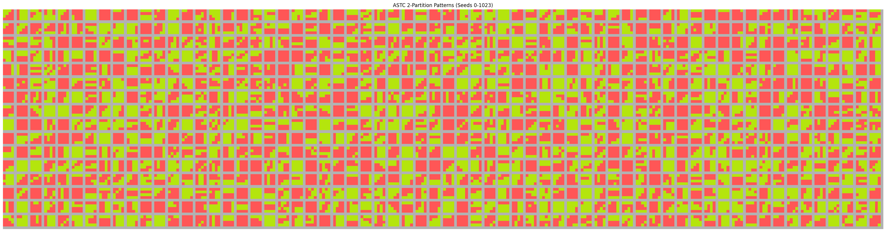

# rt-astcenc-glsl
Fast real-time GPU accelerated low(est)-quality astc encoder for texture recompression on ARM GPUs

## Encoder Design

The ASTC encoder (in astc_compress.comp, written in glsl) tries to do an extremely fast (basically memory-bound on even old low-end GPUs) encoding of plain rgba8 textures into 4x4 single-partition rgb(a)-ldr format with the following conditions:

1. 4x4 blocks containing any semitransparent pixels will encode to rgba-ldr with RANGE_32 quant for color endpoints and RANGE_16 quant for weights - see pack_astc_block_rgba_5_4
2. 4x4 blocks containing only opaque pixels will encode to rgb-ldr with RANGE_32 quant for color endpoints and **RANGE_32 quant for weights** - see pack_astc_block_rgb_5_5
3. Endpoint selection is done naively (for now) using aabb (min-max) on the color volume of the block

A fundamental tradeoff we'll always have to be wary of is that between color variety and color fidelity. Meaning, there's a fundamental tradeoff due to the limited block size (128b) between how many visually distinct colors you can represent within the 4x4 area versus how accurate you represent those colors.

### Demo

**Original**


**ASTC Encoded**


**With parallelized astc packing**

```bash
$ sh run.sh 
astc_compress.comp
Using device: AMD Radeon Graphics (RADV RENOIR)
Device timestamp period: 10 ns
Uploading uniform data...
----------------------------------------
GPU buffer copy time: 0.00105 ms
----------------------------------------
Uploading pixel data...
----------------------------------------
GPU buffer copy time: 0.0012 ms
----------------------------------------
Submitting...
Completed...
----------------------------------------
GPU to dispatch time: 2.29248 ms
GPU to barrier time: 0.01144 ms
GPU to copy astc output buffer time: 0.13944 ms
GPU to copy decoded output buffer time: 1.85716 ms
----------------------------------------
GPU execution finished.
```

**Without parallelized astc packing**

```
$ sh run.sh 
astc_compress.comp
Using device: AMD Radeon Graphics (RADV RENOIR)
Device timestamp period: 10 ns
Uploading uniform data...
----------------------------------------
GPU buffer copy time: 0.0011 ms
----------------------------------------
Uploading pixel data...
----------------------------------------
GPU buffer copy time: 0.0012 ms
----------------------------------------
Submitting...
Completed...
----------------------------------------
GPU to dispatch time: 2.34636 ms
GPU to barrier time: 0.01388 ms
GPU to copy astc output buffer time: 0.13948 ms
GPU to copy decoded output buffer time: 2.17108 ms
----------------------------------------
GPU execution finished.
```

As you can see, there's no appreciable difference in the actual compute shader time. In fact, it's suspiciously similar to that final device-to-host IO time, which suggests that micro-optimizing the shader to reduce stalls / increase occupancy isn't worth it because we're just completely dominated by the IO latency due to low gobal memory bandwidth.

### Stages

#### Setup

```glsl
    uint pixel_idx = gl_LocalInvocationID.x; // 0..15
    uint block_idx = gl_LocalInvocationID.y; // 0..3
    uint lane_id = block_idx * 16 + pixel_idx;
    uint global_block_id = gl_WorkGroupID.x * 4 + block_idx;

    if (global_block_id >= g_num_total_blocks) return;
```

A warp/wavefront consists of 4 blocks of 16 threads, with each thread dedicated to a single pixel in the 4x4 block. One warp effectively encodes 4 4x4 blocks in parallel (to minimize kernel startup cost, though doing a single block of 16 threads should be ~ just as fast)

```glsl
    s_block_pixels[lane_id] = g_in_blocks[global_block_id * 16 + pixel_idx];
```

Each thread loads an rgba (vec4) color pixel from global memory into shared memory

#### Semitransparency Testing

The first stage of the shader checks to see if there are any transparent pixels in this block, as we'd like to use a high quality quantization mode `(RANGE_32, RANGE_32)` for RGB mode when possible.

Note: this has been changed to a subgroupClusteredOr operation and inlined to the quantization section

#### Endpoint Selection

In single-partition mode, we only have to select a single pair of color endpoints. ASTC will then create a color spectrum that linearly samples from these two endpoints, and encode all 16 colors in its block as a single weight value of where it is on that spectrum (0 means ep0, 1 means ep1, and 0.75 means 0.75 * ep1 + 0.25 * ep0).

Typically, you'd want to do something like PCA to identify the best fitting line that runs through your color point-cloud in your block. I'm lazy so I'm using a much simpler heuristic - just find the "bounding box" of the point cloud, and then use the "smallest" color and the "largest" color as the endpoints. It doesn't really make sense, but works surprisingly well.

Note philosophically, a single-partition encoding within ASTC means that you can only represent colors sampled from a single gradient between two color endpoints. This generally works well for natural images, but tends to break down when you have blocks that are "noisy" or "high-frequency", e.g. consisting of random splots of colors. This is the main downside of this fast-encoding method - lack of color fidelity since every 16-pixel block must sample from a single color gradient.

```glsl
    // Endpoint Selection (AABB) via clustered subgroup min/max
    vec4 Ea = subgroupClusteredMin(my_pixel, 16);
    vec4 Eb = subgroupClusteredMax(my_pixel, 16);
```

~This is yet another segmented reduction to find the min and max of the array, similar to above~

This has been replaced by a pair of subgroupClusteredMin/Max operations

#### Weight Projection

```glsl
    // Weight calculation via projection onto Eb-Ea
    vec4 E_delta = Eb - Ea;
    float dot_delta = dot(E_delta, E_delta) + 1e-9f;
    vec4 P = s_block_pixels[lane_id];
    float proj = dot(P - Ea, E_delta) / dot_delta;
    proj = clamp(proj, 0.0, 1.0);
```

#### Quantization and ASTC Packing

```glsl
    // Quantization
    bool is_transparent = subgroupOr(my_pixel.a < 0.99f); // Reduces divergence if subgroup/wavefront has heterogeneous alpha
    uint weight_bits = is_transparent ? WEIGHT_BITS_TRANS : WEIGHT_BITS_OPAQUE;
    uint final_q_weight_idx = quantize_to_index(proj, weight_bits);
    s_final_q_weights[lane_id] = final_q_weight_idx;
    barrier(); memoryBarrierShared();

    // ASTC Packing (TODO)
    if (pixel_idx == 0) {
        vec4 q_Ea = Ea;
        vec4 q_Eb = Eb;
        uvec4 packed_block;

        if (is_transparent) {
            packed_block = pack_astc_block_rgba_5_4(q_Ea, q_Eb, lane_id);
        } else {
            packed_block = pack_astc_block_rgb_5_5(q_Ea.rgb, q_Eb.rgb, lane_id);
        }

        g_out_compressed_blocks[global_block_id] = packed_block;

        s_packed_block[block_idx] = packed_block;
    }
```

### The 4x4 2-Partition Patterns

See 

### TODO

1. ~Use PCA color selection~ - our shader is absolutely not shader-bound right now (that said, the astc packing itself is the biggest source of flops, so that might push us over the edge). If we're excessively memory bound, then using PCA will probably still be hidden behind global memory latency
2. ~Change to subgroup primitives instead of coding our own segmented reductions~
3. Try 2-partition (using a 128kb LUT uniform ssbo)
4. Try dual-plane (alpha-encoding channel)
5. Try a greedy Ep selection algorithm
6. ~Add parallelized astc format packing~

More sophisticated tricks to increase color diversity (2-p) or fidelity (dual-plane) may not work as well due to heavier quantization needed. I'll need to prototype these in torch first to see if they even increase visual fidelity. Should not heavily regress performance however.
