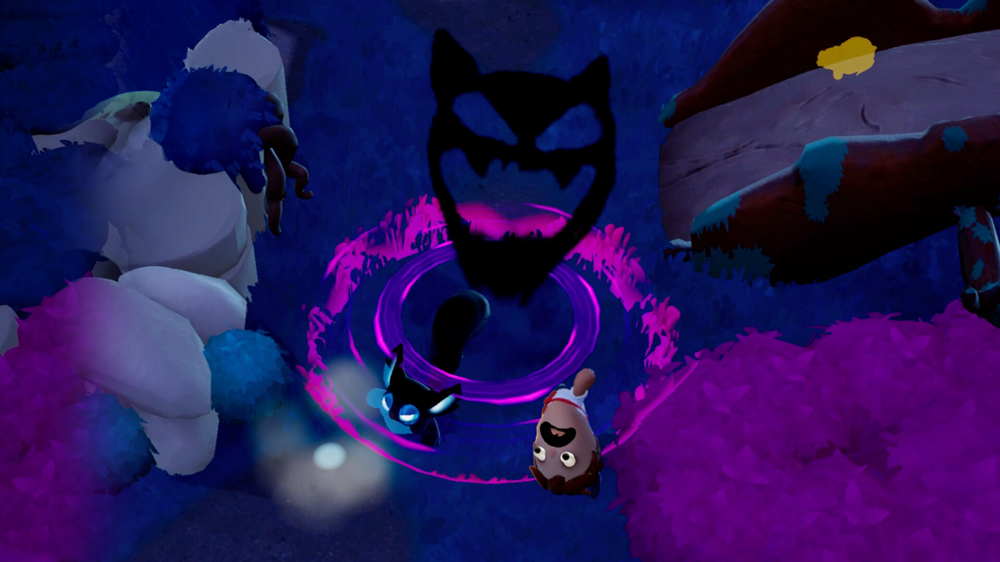

# rt-astcenc-glsl
Fast real-time GPU accelerated low(est)-quality astc encoder for texture recompression on ARM GPUs

## Encoder Design

The ASTC encoder (in astc_compress.comp, written in glsl) tries to do an extremely fast (basically memory-bound on even old low-end GPUs) encoding of plain rgba8 textures into 4x4 single-partition rgb(a)-ldr format with the following conditions:

1. 4x4 blocks containing any semitransparent pixels will encode to rgba-ldr with RANGE_32 quant for color endpoints and RANGE_16 quant for weights - see pack_astc_block_rgba_5_4
2. 4x4 blocks containing only opaque pixels will encode to rgb-ldr with RANGE_32 quant for color endpoints and **RANGE_32 quant for weights** - see pack_astc_block_rgb_5_5
3. Endpoint selection is done naively (for now) using aabb (min-max) on the color volume of the block

A fundamental tradeoff we'll always have to be wary of is that between color variety and color fidelity. Meaning, there's a fundamental tradeoff due to the limited block size (128b) between how many visually distinct colors you can represent within the 4x4 area versus how accurate you represent those colors.

wgpu-py is used to run this shader for simplicity

Demo:

**Original**


**ASTC Encoded**


### Stages

#### Setup

```glsl
    uint pixel_idx = gl_LocalInvocationID.x; // 0..15
    uint block_idx = gl_LocalInvocationID.y; // 0..3
    uint lane_id = block_idx * 16 + pixel_idx;
    uint global_block_id = gl_WorkGroupID.x * 4 + block_idx;

    if (global_block_id >= g_num_total_blocks) return;
```

A warp/wavefront consists of 4 blocks of 16 threads, with each thread dedicated to a single pixel in the 4x4 block. One warp effectively encodes 4 4x4 blocks in parallel (to minimize kernel startup cost, though doing a single block of 16 threads should be ~ just as fast)

```glsl
    s_block_pixels[lane_id] = g_in_blocks[global_block_id * 16 + pixel_idx];
```

Each thread loads an rgba (vec4) color pixel from global memory into shared memory

#### Semitransparency Testing

The first stage of the shader checks to see if there are any transparent pixels in this block, as we'd like to use a high quality quantization mode `(RANGE_32, RANGE_32)` for RGB mode when possible.

```glsl
    // Transparency Check
    float my_alpha = s_block_pixels[lane_id].a;
    s_reduce_alpha_check[lane_id] = (my_alpha < 0.999f) ? 1 : 0;
    barrier(); memoryBarrierShared();

    // TODO: replace with a group operation primitive (subgroupAdd?)
    for (uint s = 8; s > 0; s >>= 1) {
        if (pixel_idx < s) {
            s_reduce_alpha_check[lane_id] += s_reduce_alpha_check[lane_id + s];
        }
        barrier(); memoryBarrierShared();
    }

    if (pixel_idx == 0) {
        s_is_transparent[block_idx] = (s_reduce_alpha_check[lane_id] > 0);
    }
    barrier(); memoryBarrierShared();
```

This shader does a basic parallel segmented add within the block/subgroup. It first transforms the problem into a counting one - threads will add +1 to s_reduce_alpha_check[0] if their pixel is semitransparent, then it does a segmented add to gather the sum into s_reduce_alpha_check[0], and finally the leader thread sets s_is_transparent.

##### Segmented Reduce

Problem: we want to compute and store a block/subgroup calculation efficiently. E.g. I have a shared memory with 16 slots, and I want to add all 16 values together. The classic way to do this in parallel programming is via a "segmented add":

```py
# Step 1 - add neighboring pairs
arr[0] = arr[0] + arr[1] # arr[0] now has the partial sum of slots 0-1
arr[2] = arr[2] + arr[3] # arr[2] now has the partial sum of slots 2-3
arr[4] = arr[4] + arr[5] # arr[4] now has the partial sum of slots 4-5
# ..., at the end of this step, arr[0], arr[2], arr[4], ..., arr[14] will contain the partial sum of arr[0] + arr[1], arr[2] + arr[3], ...

# Step 2 - "remove" the odd slots and add neighboring pairs again
arr[0] = arr[0] + arr[2] # arr[0] now has the partial sum of slots 0-3,
                         # remember arr[0] already is the partial sum of slots 0-1, and arr[2] is 2-3
arr[4] = arr[4] + arr[6] # arr[4] now has the partial sum of slots 4-7
# ..., at the end of this step, arr[0], arr[4], arr[8], ... arr[12] will contain the partial sum of their next 4 neighbors,
# and slots 1,2,3; 5,6,7; ... will no longer be needed

# Step 3 - "remove" the 1,2,3; 5,6,7; 9,10,11; 13,14,15 slots and add neighboring pairs again
arr[0] = arr[0] + arr[4] # arr[0] now has the partial sum of slots 0-7
arr[8] = arr[8] + arr[12] # arr[8] now has the partial sum of slots 8-15

# Step 4 final reduction
arr[0] = arr[0] + arr[8] # arr[0] now has the full sum of slots 0-15
```

#### Endpoint Selection

In single-partition mode, we only have to select a single pair of color endpoints. ASTC will then create a color spectrum that linearly samples from these two endpoints, and encode all 16 colors in its block as a single weight value of where it is on that spectrum (0 means ep0, 1 means ep1, and 0.75 means 0.75 * ep1 + 0.25 * ep0).

Typically, you'd want to do something like PCA to identify the best fitting line that runs through your color point-cloud in your block. I'm lazy so I'm using a much simpler heuristic - just find the "bounding box" of the point cloud, and then use the "smallest" color and the "largest" color as the endpoints. It doesn't really make sense, but works surprisingly well.

Note philosophically, a single-partition encoding within ASTC means that you can only represent colors sampled from a single gradient between two color endpoints. This generally works well for natural images, but tends to break down when you have blocks that are "noisy" or "high-frequency", e.g. consisting of random splots of colors. This is the main downside of this fast-encoding method - lack of color fidelity since every 16-pixel block must sample from a single color gradient.

```glsl
    // Endpoint Selection (AABB)
    s_reduce_min[lane_id] = s_block_pixels[lane_id];
    s_reduce_max[lane_id] = s_block_pixels[lane_id];
    barrier(); memoryBarrierShared();

    // TODO - use a subgroupPrimitive instead
    for (uint s = 8; s > 0; s >>= 1) {
        if (pixel_idx < s) {
            s_reduce_min[lane_id] = min(s_reduce_min[lane_id], s_reduce_min[lane_id + s]);
            s_reduce_max[lane_id] = max(s_reduce_max[lane_id], s_reduce_max[lane_id + s]);
        }
        barrier(); memoryBarrierShared();
    }

    if (pixel_idx == 0) {
        s_Ea[block_idx] = s_reduce_min[lane_id];
        s_Eb[block_idx] = s_reduce_max[lane_id];
    }
    barrier(); memoryBarrierShared();
```

This is yet another segmented reduction to find the min and max of the array, similar to above

#### Weight Projection

```glsl
    // Weight calculation via projection onto Eb-Ea
    vec4 E_delta = s_Eb[block_idx] - s_Ea[block_idx];
    float dot_delta = dot(E_delta, E_delta) + 1e-9f; // in case the proj is 0
    vec4 P = s_block_pixels[lane_id];
    float proj = dot(P - s_Ea[block_idx], E_delta) / dot_delta;
    s_ideal_weights[lane_id] = clamp(proj, 0.0, 1.0);
```

#### Quantization and ASTC Packing

```glsl
    // Quantization
    bool transparent = s_is_transparent[block_idx];
    uint weight_bits = transparent ? WEIGHT_BITS_TRANS : WEIGHT_BITS_OPAQUE;
    uint final_q_weight_idx = quantize_to_index(s_ideal_weights[lane_id], weight_bits);
    s_final_q_weights[lane_id] = final_q_weight_idx;
    barrier(); memoryBarrierShared();

    // ASTC Packing (TODO)
    if (pixel_idx == 0) {
        bool is_final_transparent = s_is_transparent[block_idx];
        vec4 q_Ea = s_Ea[block_idx];
        vec4 q_Eb = s_Eb[block_idx];
        uvec4 packed_block;

        if (is_final_transparent) {
            packed_block = pack_astc_block_rgba_5_4(q_Ea, q_Eb, lane_id);
        } else {
            packed_block = pack_astc_block_rgb_5_5(q_Ea.rgb, q_Eb.rgb, lane_id);
        }

        g_out_compressed_blocks[global_block_id] = packed_block;

        s_packed_block[block_idx] = packed_block;
    }
```